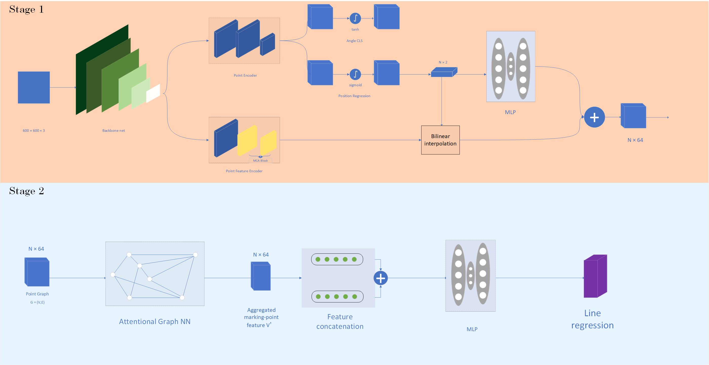
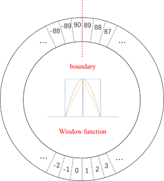
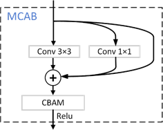
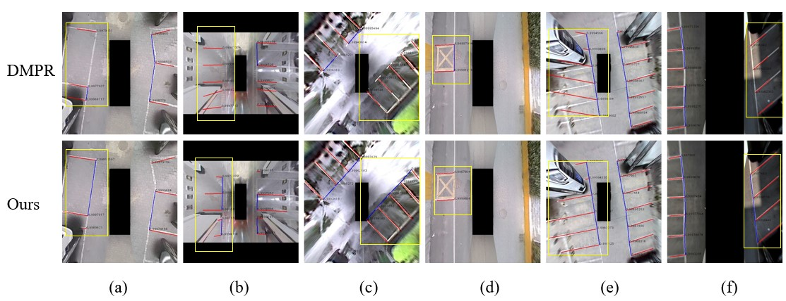

# Parking Slot Detection Based on Polar Coordinate Attention Graph Neural Network

## Introduction

Our project is driven by studying non-standard parking spaces (parking space lines are not standard L-shaped or T-shaped, parking space lines are not clear, and parking space detection without parking space lines), and we hope to solve the problem of driverless vehicle parking. Convenience and security are further explored.



Figure 1. Model Structure																														



​																											Figure 2.CSL (circular smooth label) 



​																					Figure 3.MCAB(multi-branch convolutional attention block)

As shown in Figure 1, our final model mainly consists of two stages. The first stage predicts the corner point and the angle of the corner point, and the second stage predicts the parking space entry line. In the first stage, we choose the pytorch version of YAD2K as the backbone for model feature extraction, and then pass the formed feature maps through the point detector and point feature encoder respectively. The former detects corner point information and the angle and length of the parking space separation line in polar coordinates with the corner point as the origin. The latter obtains the final result of the first stage through bilinear interpolation and feature fusion based on the corner point position information (x, y). High-dimensional corner point location feature information. Among them, N represents the maximum number of predicted corner points in a single image set by the model. In the second stage, through the aggregation of feature information in the first stage through the attention map neural network GAT, the model can obtain and encode the internal connection between the corner positions. Finally, through feature splicing and MLP, it is possible to realize whether each two corner points are Constitute a two-class prediction of parking spaces and output the final parking space detection results.

As shown in Figure 2, the main idea of CSL [3] is to convert the regression problem of angle prediction into a multi-classification problem, set 180 angle categories from 0 to 179 degrees, and calculate the prediction result loss through BCEwithlogitsLoss. At the same time, in order to avoid the angle periodicity problem (Periodicity of Angular, PoA) of simple angle multi-classification and the loss of distance information between the angle prediction value and the true value, CSL introduces a window function in the angle groundtruth that can encode all angle classifications. Since the window function has the characteristics of periodicity, symmetry, and monotonicity within the window at the same time, when encoding each angle to achieve prediction, the closer to the true value within a certain range, the smaller the prediction loss, and the periodicity of the window function solves the problem. Periodic issues in angle prediction.

As shown in Figure 3, we introduce the self-developed MCABlock module into the point feature encoder. Some studies [6] believe that one explanation for the good performance of ResNet is that the branch structure (shortcut) of ResNet generates an implicit ensemble model of a large number of sub-models (because every time a branch is encountered, the total path doubles) , even if some paths are deleted, the impact on the model results is smooth. The single-channel architecture obviously does not have this characteristic. The Ensembling model contains several basic models with different initial conditions or structures, and certain performance improvements can be achieved through simple voting. Generally speaking, a characteristic of the ensemble model is that the more members participate in voting, the better the performance of the overall model will be. However, when the number of members is large, as the number of members increases, the improvement in accuracy becomes smaller. We expanded the single-way CONV unit of the original model to a three-way structure by incorporating the 1×1 convolution and identity mapping parts into the 3×3 convolution structure. A three-branch structure that constitutes a single convolutional layer. This branch structure can be defined as


$$y_i=f^{3\times3}(y_{i-1})+f^{1\times 1}(y_{i-1})+y_{i-1}$$
where $y_i,y_{i-1}$ represents the output and input of the module，and $f$ represents the structure including convolutional layer and batch-norm layer. In order to further improve the performance of the module, we introduce channel and spatial attention module CBAM based on multi-branch convolution to accelerate the convergence of the model.

Novelty includes:

-  Polar coordinate representation of corner points for parking space detection, from regression of corner points to regression of line segments
- Implement a new non-maximum suppression method - angle-based non-maximum suppression
- Introducing new lightweight backbones to improve inference speed while maintaining model performance
- Independent experimental research results MCABlock, a module that introduces implicit ensemble ideas and attention mechanisms in the field of parking space detection, to accelerate model convergence
- Introducing csl (Circular Smooth Labels) and dcl (Densely Coded Labels) in the field of parking space detection to further improve angle prediction accuracy

## Model comparison



| model             | GFLOPS  | params/M | inference  time/ms | precision-point/% | recall-point/% | precision-angle/% | recall-angle/% | precision-slot/% | recall-slot/% |
| ----------------- | ------- | -------- | ------------------ | ----------------- | -------------- | ----------------- | -------------- | ---------------- | ------------- |
| dmpr-ps[1]        | 23.1406 | 30.3071  | 26.88              | 80.87             | 84.02          | 33.21             | 49.26          | 19.96            | 20.24         |
| agnnpd[2]         | 88.0961 | 38.774   | 70.399             | 80.50             | 81.60          | 0.00              | 0.00           | 58.95            | 67.42         |
| pcgnn(ours)       | 88.0968 | 38.7771  | 73.22              | 80.68             | 82.17          | 71.86             | 79.79          | 59.07            | 68.15         |
| pcgnn-final(ours) | 25.9305 | 41.695   | 50.62              | **80.95**         | **84.07**      | **79.98**         | **81.69**      | **66.17**        | **70.08**     |

**backbones**

| model           | GFLOPS   | params/M | inference  time/ms | precision-point/% | recall-point/% | precision-angle/% | recall-angle/% | precision-slot/% | recall-slot/% |
| --------------- | -------- | -------- | ------------------ | ----------------- | -------------- | ----------------- | -------------- | ---------------- | ------------- |
| pcgnn-vgg16     | 88.0968  | 38.7771  | 73.22              | 80.68             | 82.17          | 71.86             | 79.79          | 59.07            | 68.15         |
| pcgnn-darknet   | 25.8837  | 41.5117  | 53.203             | **81.05**         | **83.79**      | 71.85             | **80.55**      | **60.22**        | **70.08**     |
| pcgnn-res18     | 23.99491 | 34.648   | 40.85              | 72.15             | 79.32          | 71.70             | 77.22          | 58.92            | 66.77         |
| pcgnn-res50     | 20.70486 | 55.4286  | 47.57              | 80.67             | 81.03          | 71.93             | 78.55          | 58.78            | 67.90         |
| pcgnn-hrnet[5]  | 24.471   | 40.2276  | 65.79              | 81.01             | 81.93          | **72.01**         | 79.17          | 59.31            | 68.39         |
| pcgnn-mobilenet | 6.6807   | 23.6444  | 42.82              | 71.92             | 79.60          | 71.53             | 76.70          | 58.39            | 68.06         |

**angle detect**

| model              | GFLOPS  | params/M  | inference  time/ms | precision-point/% | recall-point/% | precision-angle/% | recall-angle/% | precision-slot/% | recall-slot/% |
| ------------------ | ------- | --------- | ------------------ | ----------------- | -------------- | ----------------- | -------------- | ---------------- | ------------- |
| pcgnn-vgg16        | 88.0968 | 38.7771   | 73.22              | 80.68             | 82.17          | 71.86             | 79.79          | 59.07            | 68.15         |
| pcgnn-vgg16-dcl[4] | 88.0987 | 38.784225 | 74.41              | **80.90**         | 82.16          | 71.71             | 79.69          | **59.54**        | 68.42         |
| pcgnn-vgg16-csl    | 88.1438 | 38.9603   | **74.86**          | 80.54             | **82.17**      | **79.53**         | **80.12**      | 58.24            | **68.79**     |

**MCAB** ablation experiment

| model              | GFLOPS   | params/M | inference  time/ms | precision-point/% | recall-point/% | precision-angle/% | recall-angle/% | precision-slot/% | recall-slot/% |
| ------------------ | -------- | -------- | ------------------ | ----------------- | -------------- | ----------------- | -------------- | ---------------- | ------------- |
| pcgnn-hrnet        | 24.47103 | 40.2276  | 65.79              | 81.01             | 81.93          | **72.01**         | 79.17          | 59.31            | 68.39         |
| pcgnn-hrnet-mcab-2 | 24.4706  | 40.3598  | 62.48              | 80.92             | 81.60          | 71.77             | 78.70          | 59.35            | 67.02         |
| pcgnn-hrnet-mcab-4 | 24.47106 | 40.3598  | 62.86              | **81.14**         | **82.07**      | 71.86             | **79.36**      | **59.48**        | **69.60**     |

## Experimental setup

|           |                                                              |
| --------- | ------------------------------------------------------------ |
| OS        | ubuntu18.04                                                  |
| GPU       | RTX 3090                                                     |
| CPU       | 14 Intel(R) Xeon(R) Gold 6330 CPU @ 2.00GHz 48G          |
| epoch     | 200                                                          |
| batchsize | 32                                                           |
| mechanic  | Interplolated AP                                             |
| baseline  | AGNNPD [GitHub -   Jiaolong/gcn-parking-slot: Attentional graph neural network for parking slot   detection](https://github.com/Jiaolong/gcn-parking-slot) |

- python 3.6

- pytorch 1.4+

- other requirements: `pip install -r requirements.txt`

## Datasets

Our data will be open source on github. Please reorganize the data according to the following format.

```
├── Datasets
│   └── bjtu-ps1
│       ├── main
│       ├── label
│       ├── img
```


- data_root: &data_root ***

## Train & Test

- train

```
python train.py -c config/*.yaml
```

- test

```
python test.py -c config/*.yaml -m cache/*
```

## Reference

[1] J. Huang, L. Zhang, Y. Shen, H. Zhang, and Y. Yang, “DMPR-PS: A novel approach for parking-slot detection using directional marking-point regression,” in IEEE International Conference on Multimedia and Expo (ICME), 2019. [code](https://github.com/Teoge/DMPR-PS)

[2] Chen Min et al. “Attentional Graph Neural Network for Parking-Slot Detection” international conference on robotics and automation (2021): n. pag. [code](https://github.com/Jiaolong/gcn-parking-slot)

[3] Xue Yang and Junchi Yan. “Arbitrary-Oriented Object Detection with Circular Smooth Label” european conference on computer vision (2020): n. pag.

[4] Xue Yang et al. “Dense Label Encoding for Boundary Discontinuity Free Rotation Detection” arXiv: Computer Vision and Pattern Recognition (2020): n. pag.

[5] Yuzhao Chen et al. “Hrnet: Hamiltonian Rescaling Network for Image Downscaling”  (2020).

[6] Andreas Veit, Michael J Wilber, and Serge Belongie. Residual networks behave like ensembles of relatively shallow networks. In Advances in neural information processing systems, pages 550–558, 2016. 2, 4, 8

